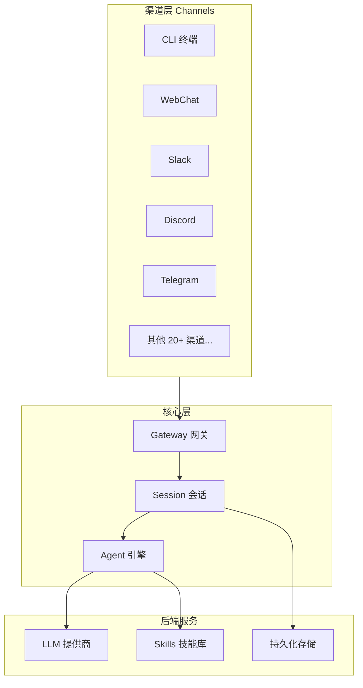

# 第一章：认识 OpenClaw

## 什么是 OpenClaw？

OpenClaw 是一个**开源的 AI 个人助手框架**，允许用户在本地运行自己的 AI Agent。截至目前，OpenClaw 在 GitHub 上已经积累了超过 **247,000** 颗星标，是全球最受欢迎的开源 AI Agent 项目之一。

OpenClaw 由知名开发者 **Peter Steinberger** 创建并领导开发，其核心理念是：

- **本地优先（Local-first）**：你的数据留在你的设备上
- **完全可控**：你决定 AI 能访问什么、能做什么
- **高度可扩展**：通过 Skills 系统支持无限功能拓展

```bash
# 一行命令即可开始体验
npx openclaw@latest init
```

## 发展历史：从 Moltbot 到 OpenClaw

OpenClaw 的发展经历了三个重要阶段：

| 阶段 | 名称 | 时间 | 关键特性 |
|------|------|------|----------|
| v0.x | **Moltbot** | 2023 年初 | 最初的原型，仅支持命令行交互 |
| v1.x | **Clawdbot** | 2023 年中 | 引入 Skills 系统和多渠道支持 |
| v2.x | **OpenClaw** | 2024 年初至今 | 完全重构，开源社区驱动 |

### Moltbot 时代（v0.x）

Moltbot 是 Peter Steinberger 的一个个人实验项目。最初只是一个简单的 CLI 工具，用于将 LLM 与本地文件系统连接起来。虽然功能简单，但它证明了"让 AI 访问本地环境"这一思路的可行性。

### Clawdbot 时代（v1.x）

随着用户群体的增长，项目被重命名为 Clawdbot，并引入了两个关键创新：

1. **Skills 系统**：允许社区贡献独立的功能模块
2. **Channel 架构**：将交互界面从 CLI 扩展到 Slack、Discord、Telegram 等 20 多个平台

### OpenClaw 时代（v2.x）

2024 年初，项目进行了完全的架构重构并更名为 OpenClaw，采用了全新的 Gateway-Agent-Session 三层架构，成为一个真正的企业级 AI Agent 平台。

## OpenClaw vs 其他 AI 工具

很多初学者会问：OpenClaw 和 ChatGPT、GitHub Copilot 有什么区别？下面是一个详细的对比：

| 特性 | OpenClaw | ChatGPT | GitHub Copilot |
|------|----------|---------|----------------|
| **运行方式** | 本地部署 | 云端服务 | 云端 + 编辑器插件 |
| **数据隐私** | 数据完全本地 | 数据上传至 OpenAI | 代码片段上传至 GitHub |
| **开源** | 完全开源（MIT） | 闭源 | 闭源 |
| **可定制性** | 高度可定制 | 有限定制 | 有限定制 |
| **LLM 支持** | 多模型自由切换 | 仅 OpenAI 模型 | 仅 GitHub/OpenAI 模型 |
| **文件访问** | 完整本地文件访问 | 无本地访问 | 仅编辑器内文件 |
| **自动化** | 支持 Webhook/Cron/Poll | 不支持 | 不支持 |
| **价格** | 免费（需自备 API Key） | 订阅制 | 订阅制 |
| **扩展系统** | 13,700+ 社区 Skills | GPTs Store | 扩展有限 |
| **渠道支持** | 20+ 渠道 | Web/App | 编辑器内 |

**核心差异总结**：ChatGPT 和 Copilot 是"你去找 AI"，而 OpenClaw 是"AI 来到你身边"——它运行在你的环境中，访问你的数据，为你执行任务。

## 核心架构

OpenClaw 采用经典的三层架构设计，各层职责清晰：



### Gateway（网关守护进程）

Gateway 是 OpenClaw 的入口和调度中心，以守护进程的方式运行在后台。它的主要职责包括：

- **请求路由**：接收来自各种渠道的消息，分发给正确的 Session
- **认证授权**：管理用户身份和权限
- **连接管理**：维护与各渠道的长连接
- **负载均衡**：在多 Agent 场景下分配请求

```bash
# Gateway 默认监听端口
openclaw gateway start --port 18789
```

### Agent（LLM 调用引擎）

Agent 是 OpenClaw 的大脑，负责与大语言模型交互。每个 Agent 实例可以：

- **选择 LLM 后端**：支持 OpenAI、Anthropic、Moonshot、DeepSeek 等
- **管理上下文窗口**：智能的上下文裁剪和压缩
- **调用 Skills**：根据用户意图自动选择并调用合适的技能
- **流式输出**：实时返回生成结果

### Session（会话管理器）

Session 负责管理对话的生命周期：

- **对话历史**：保存和恢复对话上下文
- **状态管理**：跟踪多轮对话的状态
- **记忆系统**：长期记忆和短期记忆的管理
- **用户画像**：根据对话积累用户偏好

## 核心特性一览

### 1. 本地优先

所有数据（对话记录、知识库、配置）默认存储在本地，不依赖任何云服务。你只需要一个 LLM API Key 即可使用。

### 2. 多渠道接入

通过 Channel 抽象层，OpenClaw 支持超过 **20 种**消息渠道，包括：

- 命令行终端（TUI）
- Web 聊天界面
- Slack / Discord / Telegram
- 微信（通过第三方桥接）
- Email
- REST API

### 3. Skills 技能系统

社区已经贡献了超过 **13,700 个** Skills，涵盖：

- 文件操作与代码辅助
- 日程管理与提醒
- 数据查询与分析
- 智能家居控制
- DevOps 自动化

### 4. 自动化引擎

支持三种触发机制：

- **Webhook**：外部事件触发
- **Cron**：定时任务
- **Poll**：轮询数据源

## 典型使用场景

### 个人助手

- 管理日程、设置提醒
- 整理笔记、总结文档
- 查询天气、新闻等日常信息

### 开发工具

- 阅读和解释代码
- 生成单元测试
- 代码审查和重构建议
- 自动化 CI/CD 流程

### 企业自动化

- 自动化报告生成
- 客户服务机器人
- 内部知识库问答
- 跨系统数据集成

## 本章小结

通过本章，你应该对 OpenClaw 有了基本的认识：

1. OpenClaw 是一个**开源、本地优先**的 AI Agent 框架
2. 它经历了 Moltbot → Clawdbot → OpenClaw 的演进
3. 核心架构由 **Gateway + Agent + Session** 三层组成
4. 相比 ChatGPT 等云端服务，OpenClaw 提供了更高的**隐私保护和可定制性**
5. 拥有庞大的社区和丰富的 Skills 生态

在下一章中，我们将动手搭建 OpenClaw 的开发环境。

---

> **下一章**：[环境搭建](/guide/02-setup)
