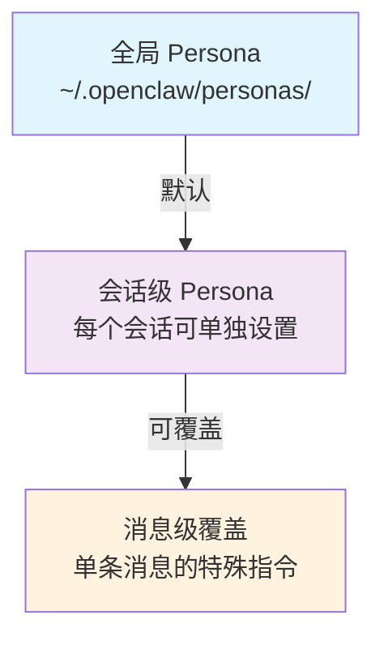

# 第三章：快速上手

## 发送你的第一条消息

在上一章中，我们已经完成了 OpenClaw 的安装和配置。现在，让我们开始第一次对话。

### 通过 CLI 发送消息

最直接的方式是通过命令行：

```bash
# 启动交互式对话
openclaw chat

# 或者直接发送单条消息
openclaw ask "你好，请介绍一下你自己"
```

启动 `openclaw chat` 后，你会看到一个交互式的终端界面（TUI）：

```
╔══════════════════════════════════════════════╗
║  OpenClaw v2.8.3 - Interactive Chat          ║
║  Type /help for available commands           ║
║  Type /quit to exit                          ║
╚══════════════════════════════════════════════╝

You > 你好，请介绍一下你自己

OpenClaw > 你好！我是 OpenClaw，一个运行在你本地环境中的
AI 助手。我可以帮你完成各种任务，包括：

- 阅读和编辑本地文件
- 回答问题和进行对话
- 执行自动化任务
- 管理你的日程和提醒

有什么我可以帮你的吗？

You > _
```

### 通过 Dashboard 发送消息

如果你更喜欢图形界面，打开浏览器访问 Dashboard：

```
http://127.0.0.1:18789/dashboard
```

在 Dashboard 的对话界面中，你可以像使用 ChatGPT 一样与 OpenClaw 交流，同时还能看到：

- 当前使用的 LLM 模型
- Token 消耗统计
- Skills 调用记录
- 实时响应状态

## 认识交互界面

OpenClaw 提供了三种主要的交互界面，适合不同的使用场景。

### TUI（终端用户界面）

TUI 是为命令行爱好者设计的交互界面，具有以下特点：

```bash
# 启动 TUI
openclaw chat --tui

# TUI 快捷键
# Ctrl+L    清屏
# Ctrl+C    取消当前生成
# Ctrl+D    退出
# Tab       自动补全命令
# 上/下箭头  浏览历史消息
```

TUI 界面分为几个区域：

```
┌──────────────────────────────────────────┐
│ [会话名称]          [模型: gpt-4o] [Tokens: 1.2k] │
├──────────────────────────────────────────┤
│                                          │
│  对话内容区域                              │
│  - 支持 Markdown 渲染                     │
│  - 支持代码高亮                            │
│  - 支持图片展示（iTerm2）                   │
│                                          │
├──────────────────────────────────────────┤
│ > 输入区域                                │
│   支持多行输入（Shift+Enter 换行）          │
└──────────────────────────────────────────┘
```

### Dashboard（Web 界面）

Dashboard 提供了最完整的功能体验：

- 对话历史侧边栏
- 实时 Token 统计
- Skills 调用可视化
- 文件预览（代码高亮、图片、PDF）
- 多会话标签页

### WebChat（嵌入式聊天组件）

WebChat 是一个可以嵌入到任何网页中的轻量级聊天组件：

```html
<!-- 在你的网页中嵌入 OpenClaw 聊天窗口 -->
<script src="http://127.0.0.1:18789/webchat.js"></script>
<script>
  OpenClawChat.init({
    endpoint: 'http://127.0.0.1:18789',
    theme: 'light',
    position: 'bottom-right',
    greeting: '你好！有什么可以帮你的？'
  });
</script>
```

## 基础命令与交互

在对话中，你可以使用 `/` 前缀来执行特殊命令：

### 系统命令

```bash
/help              # 显示所有可用命令
/quit              # 退出对话
/clear             # 清空当前会话历史
/reset             # 重置会话（清除记忆和上下文）
/status            # 查看当前系统状态
/version           # 查看 OpenClaw 版本
```

### 模型控制命令

```bash
/model list        # 列出所有可用模型
/model use gpt-4o  # 切换到指定模型
/model info        # 查看当前模型信息

# 示例输出
You > /model list
Available models:
  * openai/gpt-4o (current)
    openai/gpt-4o-mini
    anthropic/claude-sonnet-4-20250514
    moonshot/moonshot-v1-128k
    deepseek/deepseek-chat
```

### 会话管理命令

```bash
/session list      # 列出所有会话
/session new       # 创建新会话
/session switch <id>  # 切换到指定会话
/session rename <name>  # 重命名当前会话
/session export    # 导出当前会话为 JSON
```

### Skills 命令

```bash
/skills list       # 列出已安装的技能
/skills search <关键词>  # 搜索社区技能
/skills install <name>   # 安装技能
/skills info <name>      # 查看技能详情
```

## 设置 Persona（人设）

OpenClaw 允许你自定义 AI 助手的性格和行为方式，这通过 **Persona** 系统实现。

### 使用内置 Persona

```bash
/persona list      # 列出可用的 Persona

# 可用 Persona:
# - default         默认助手
# - coder           编程专家
# - writer          写作助手
# - analyst         数据分析师
# - teacher         教学导师

/persona use coder  # 切换到编程专家模式
```

### 自定义 Persona

在配置目录中创建自定义 Persona 文件：

```yaml
# ~/.openclaw/personas/my-assistant.yaml
name: "小助手"
description: "一个友好的中文 AI 助手"
system_prompt: |
  你是一个名为"小助手"的 AI 助理。请遵循以下规则：
  1. 始终使用中文回复
  2. 回答要简洁明了，避免冗长
  3. 遇到不确定的问题时，诚实说明
  4. 在涉及代码时，提供完整的可运行示例
  5. 主动提供相关的补充建议

temperature: 0.7
max_tokens: 2048
greeting: "你好！我是小助手，今天想聊点什么？"
```

```bash
# 使用自定义 Persona
/persona use my-assistant
```

### Persona 的作用范围



## 文件访问权限

OpenClaw 运行在你的本地环境中，具有访问文件系统的能力。但出于安全考虑，这需要明确的权限配置。

### 配置文件访问范围

```yaml
# ~/.openclaw/config.yaml
security:
  file_access:
    # 允许访问的目录（白名单）
    allowed_paths:
      - ~/Documents
      - ~/Projects
      - ~/Desktop

    # 禁止访问的目录（黑名单，优先级高于白名单）
    denied_paths:
      - ~/.ssh
      - ~/.gnupg
      - ~/.openclaw/config.yaml

    # 文件操作权限
    permissions:
      read: true      # 允许读取文件
      write: true     # 允许写入文件
      execute: false   # 禁止执行文件
      delete: false    # 禁止删除文件
```

### 运行时权限确认

当 OpenClaw 需要访问文件时，默认会请求你的确认：

```
You > 请帮我查看 ~/Projects/myapp/README.md 的内容

OpenClaw > 我需要读取文件 ~/Projects/myapp/README.md。
[Allow] [Deny] [Allow All for this session]

You > [Allow]

OpenClaw > 以下是 README.md 的内容：
...
```

你可以调整确认策略：

```yaml
security:
  confirmation:
    mode: "ask"        # ask: 每次询问, session: 会话内只问一次, trust: 全部信任
    timeout: 30        # 超时自动拒绝（秒）
```

## 测试基本能力

让我们通过几个简单的例子来测试 OpenClaw 的基本能力。

### 测试 1：基础对话

```
You > 请用一句话解释什么是 RESTful API

OpenClaw > RESTful API 是一种基于 HTTP 协议的 Web 服务设计风格，
通过 URL 标识资源、HTTP 方法（GET/POST/PUT/DELETE）表示操作，
以无状态的方式实现客户端与服务端之间的数据交互。
```

### 测试 2：代码生成

```
You > 用 Python 写一个简单的 HTTP 服务器，返回当前时间

OpenClaw > 这是一个简单的 Python HTTP 服务器：
```

```python
from http.server import HTTPServer, BaseHTTPRequestHandler
from datetime import datetime
import json

class TimeHandler(BaseHTTPRequestHandler):
    def do_GET(self):
        self.send_response(200)
        self.send_header('Content-Type', 'application/json')
        self.end_headers()
        response = {
            'current_time': datetime.now().isoformat(),
            'timezone': 'local'
        }
        self.wfile.write(json.dumps(response).encode())

if __name__ == '__main__':
    server = HTTPServer(('localhost', 8080), TimeHandler)
    print('Server running on http://localhost:8080')
    server.serve_forever()
```

### 测试 3：文件操作

```
You > 请列出我 ~/Projects 目录下的所有子目录

OpenClaw > [调用 Skill: filesystem.list_directory]
以下是 ~/Projects 目录下的子目录：

1. myapp/          (最后修改: 2026-03-01)
2. blog/           (最后修改: 2026-02-28)
3. data-analysis/  (最后修改: 2026-02-25)
4. openclaw-skills/ (最后修改: 2026-03-04)
```

### 测试 4：多轮对话

```
You > 我想学习 Rust 语言

OpenClaw > Rust 是一门系统级编程语言，以内存安全和高性能著称。
你想从哪个方面开始了解？
1. 安装和环境搭建
2. 基础语法入门
3. 所有权和借用机制
4. 实际项目示例

You > 从基础语法开始吧

OpenClaw > 好的，让我们从 Rust 的基础语法开始...
（OpenClaw 会记住上下文，知道你在学习 Rust）
```

## 常用对话技巧

### 给出明确的指令

```
# 不太好的提问
You > 帮我写个程序

# 更好的提问
You > 请用 TypeScript 写一个函数，接收一个字符串数组，
返回其中最长的字符串。如果有多个同样长的，返回第一个。
请包含类型定义和单元测试。
```

### 利用上下文

```
You > 请阅读 ~/Projects/myapp/src/index.ts

OpenClaw > [读取文件内容...]

You > 这段代码有什么潜在的性能问题？
（OpenClaw 会基于刚才读取的文件内容进行分析）
```

### 指定输出格式

```
You > 请用表格形式对比 React、Vue 和 Angular 的优缺点
You > 请用 Mermaid 流程图展示用户注册流程
You > 请用 JSON 格式输出结果
```

## 本章小结

在本章中，你学会了：

1. 通过 **CLI** 和 **Dashboard** 发送第一条消息
2. 了解了三种交互界面：**TUI、Dashboard、WebChat**
3. 掌握了基础的 **系统命令**（/help, /model, /session, /skills）
4. 学会了自定义 **Persona** 来定制 AI 行为
5. 配置了**文件访问权限**
6. 通过实际测试验证了 OpenClaw 的基本能力

下一章我们将深入探讨 OpenClaw 的本地文件管理功能。

---

> **上一章**：[环境搭建](/guide/02-setup) | **下一章**：[本地文件管理](/guide/04-local-files)
