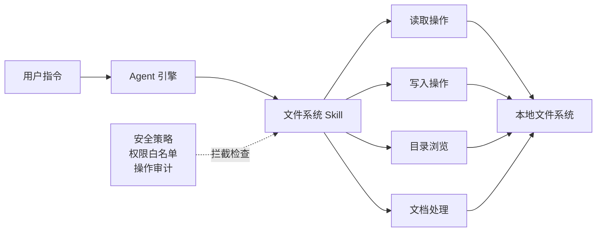

# 第四章：本地文件管理

## OpenClaw 如何访问本地文件

OpenClaw 的核心优势之一是能够直接访问和操作你的本地文件系统。与云端 AI 服务不同，OpenClaw 运行在你的设备上，因此可以像一个本地应用程序一样读写文件。

### 文件访问架构



文件访问通过内置的 `filesystem` Skill 组实现，所有操作都会经过安全策略层的检查。

### 文件访问模式

OpenClaw 支持两种文件访问模式：

```yaml
# ~/.openclaw/config.yaml
security:
  file_access:
    mode: "sandboxed"  # sandboxed: 沙盒模式, full: 完全访问模式

    # 沙盒模式下的允许路径
    sandboxed:
      allowed_paths:
        - ~/Documents
        - ~/Projects
        - ~/Downloads
```

| 模式 | 说明 | 适用场景 |
|------|------|----------|
| `sandboxed` | 仅允许访问白名单目录 | 日常使用（推荐） |
| `full` | 访问所有用户可读的文件 | 开发调试 |

## 文件读取操作

### 读取文本文件

```
You > 请阅读 ~/Projects/myapp/package.json

OpenClaw > [Skill: filesystem.read_file]
以下是 package.json 的内容：

{
  "name": "myapp",
  "version": "1.0.0",
  "scripts": {
    "dev": "vite",
    "build": "tsc && vite build"
  },
  "dependencies": {
    "react": "^18.2.0",
    "react-dom": "^18.2.0"
  }
}

这是一个使用 React + Vite 的前端项目。需要我进一步分析吗？
```

### 读取多个文件

你可以一次要求 OpenClaw 读取多个文件进行对比或分析：

```
You > 请对比 ~/Projects/myapp/tsconfig.json 和
      ~/Projects/api-server/tsconfig.json 的配置差异

OpenClaw > [Skill: filesystem.read_file x2]
两个项目的 TypeScript 配置有以下差异：

| 配置项 | myapp | api-server |
|--------|-------|------------|
| target | ES2020 | ES2022 |
| module | ESNext | CommonJS |
| jsx | react-jsx | (未设置) |
| strict | true | true |
| outDir | ./dist | ./build |

主要区别在于 myapp 是前端项目（使用 ESNext 模块和 JSX），
而 api-server 是 Node.js 后端项目（使用 CommonJS）。
```

### 读取大文件的策略

对于大型文件，OpenClaw 会智能地进行分段读取：

```
You > 请阅读 ~/Projects/data/access.log

OpenClaw > 这个日志文件有 50,000 行，比较大。我可以：
1. 读取前 100 行（概览）
2. 读取最后 100 行（最新记录）
3. 搜索特定关键词
4. 生成统计摘要

你希望我怎么处理？

You > 搜索包含 "ERROR" 的行，并统计错误类型

OpenClaw > [Skill: filesystem.search_file]
在 access.log 中找到 234 行包含 "ERROR"：

错误类型统计：
- 500 Internal Server Error: 89 次 (38%)
- 404 Not Found: 78 次 (33%)
- 403 Forbidden: 45 次 (19%)
- 502 Bad Gateway: 22 次 (10%)

最近一次错误发生在 2026-03-04 15:32:17。
需要我深入分析某种错误类型吗？
```

## 文件写入操作

### 创建新文件

```
You > 在 ~/Projects/myapp/src/ 目录下创建一个 utils.ts 文件，
      包含一个日期格式化函数和一个防抖函数

OpenClaw > [Skill: filesystem.write_file]
已创建文件 ~/Projects/myapp/src/utils.ts：
```

```typescript
/**
 * 将 Date 对象格式化为指定格式的字符串
 * @param date - 日期对象
 * @param format - 格式字符串，如 'YYYY-MM-DD HH:mm:ss'
 */
export function formatDate(date: Date, format: string = 'YYYY-MM-DD'): string {
  const pad = (n: number): string => n.toString().padStart(2, '0');

  const replacements: Record<string, string> = {
    'YYYY': date.getFullYear().toString(),
    'MM': pad(date.getMonth() + 1),
    'DD': pad(date.getDate()),
    'HH': pad(date.getHours()),
    'mm': pad(date.getMinutes()),
    'ss': pad(date.getSeconds()),
  };

  return Object.entries(replacements).reduce(
    (result, [token, value]) => result.replace(token, value),
    format
  );
}

/**
 * 创建一个防抖函数
 * @param fn - 要防抖的函数
 * @param delay - 延迟时间（毫秒）
 */
export function debounce<T extends (...args: unknown[]) => unknown>(
  fn: T,
  delay: number = 300
): (...args: Parameters<T>) => void {
  let timer: ReturnType<typeof setTimeout>;
  return (...args: Parameters<T>) => {
    clearTimeout(timer);
    timer = setTimeout(() => fn(...args), delay);
  };
}
```

### 编辑现有文件

OpenClaw 可以智能地修改现有文件的特定部分：

```
You > 在 ~/Projects/myapp/src/utils.ts 中添加一个节流函数

OpenClaw > [Skill: filesystem.edit_file]
已在 utils.ts 末尾添加节流函数。修改内容：

+ /**
+  * 创建一个节流函数
+  * @param fn - 要节流的函数
+  * @param interval - 间隔时间（毫秒）
+  */
+ export function throttle<T extends (...args: unknown[]) => unknown>(
+   fn: T,
+   interval: number = 300
+ ): (...args: Parameters<T>) => void {
+   let lastTime = 0;
+   return (...args: Parameters<T>) => {
+     const now = Date.now();
+     if (now - lastTime >= interval) {
+       lastTime = now;
+       fn(...args);
+     }
+   };
+ }
```

### 批量文件操作

```
You > 请在 ~/Projects/myapp/src/components/ 下创建以下 React 组件：
      Header、Footer、Sidebar，每个都使用 TypeScript

OpenClaw > [Skill: filesystem.write_file x3]
已创建 3 个组件文件：

1. ~/Projects/myapp/src/components/Header.tsx
2. ~/Projects/myapp/src/components/Footer.tsx
3. ~/Projects/myapp/src/components/Sidebar.tsx

每个组件都包含基础的 Props 类型定义和默认导出。
需要我调整任何组件的内容吗？
```

## 目录浏览与管理

### 查看目录结构

```
You > 以树状图展示 ~/Projects/myapp 的项目结构

OpenClaw > [Skill: filesystem.list_directory]

~/Projects/myapp/
├── package.json
├── tsconfig.json
├── vite.config.ts
├── index.html
├── public/
│   ├── favicon.ico
│   └── robots.txt
├── src/
│   ├── main.tsx
│   ├── App.tsx
│   ├── utils.ts
│   ├── components/
│   │   ├── Header.tsx
│   │   ├── Footer.tsx
│   │   └── Sidebar.tsx
│   ├── hooks/
│   │   └── useAuth.ts
│   └── styles/
│       ├── global.css
│       └── variables.css
└── tests/
    └── App.test.tsx

共 6 个目录，15 个文件。
```

### 搜索文件

```
You > 在 ~/Projects/myapp 中搜索所有包含 "useState" 的 TypeScript 文件

OpenClaw > [Skill: filesystem.search_files]
找到 4 个文件包含 "useState"：

1. src/App.tsx (第 3, 15, 28 行)
2. src/components/Header.tsx (第 5 行)
3. src/hooks/useAuth.ts (第 8, 12 行)
4. tests/App.test.tsx (第 10 行)

需要我查看某个文件的具体内容吗？
```

### 文件统计

```
You > 统计 ~/Projects/myapp/src 目录下各类型文件的数量和代码行数

OpenClaw > [Skill: filesystem.stats]

| 文件类型 | 文件数 | 总行数 | 空行 | 代码行 |
|----------|--------|--------|------|--------|
| .tsx | 5 | 342 | 45 | 297 |
| .ts | 3 | 156 | 18 | 138 |
| .css | 2 | 89 | 12 | 77 |
| **合计** | **10** | **587** | **75** | **512** |
```

## 代码辅助功能

OpenClaw 不仅能读写文件，还能深度理解代码并提供专业的辅助。

### 代码阅读与解释

```
You > 请解释 ~/Projects/myapp/src/hooks/useAuth.ts 的逻辑

OpenClaw > [Skill: filesystem.read_file]
这个自定义 Hook 实现了用户认证逻辑，主要流程如下：

1. 使用 useState 管理用户状态和 loading 状态
2. useEffect 在组件挂载时检查 localStorage 中的 token
3. login 函数向 /api/auth/login 发送 POST 请求
4. 成功后将 token 存入 localStorage 并更新状态
5. logout 函数清除 token 并重置状态

潜在改进点：
- 建议添加 token 过期检测机制
- 可以使用 useReducer 替代多个 useState 来简化状态管理
- 错误处理可以更细粒度（区分网络错误和认证错误）
```

### 代码重构建议

```
You > 请审查 ~/Projects/myapp/src/App.tsx 并提供重构建议

OpenClaw > [Skill: filesystem.read_file]
审查发现以下问题和改进建议：

1. **组件过大** (342 行) - 建议拆分为子组件
2. **状态管理混乱** - 有 8 个 useState，建议使用 useReducer
3. **副作用过多** - 3 个 useEffect 可以合并为自定义 Hook
4. **硬编码值** - API URL 应该提取为配置常量
5. **缺少错误边界** - 建议添加 ErrorBoundary 组件

需要我帮你实施这些重构吗？
```

## 文档处理能力

### 支持的文档格式

| 格式 | 支持的操作 | 需要额外插件 |
|------|-----------|-------------|
| `.txt` | 读取、写入、搜索 | 否 |
| `.md` | 读取、写入、渲染预览 | 否 |
| `.json` | 读取、写入、结构化查询 | 否 |
| `.yaml/.yml` | 读取、写入 | 否 |
| `.csv` | 读取、分析、转换 | 否 |
| `.pdf` | 读取（文本提取） | 是（`@openclaw/skill-pdf`） |
| `.docx` | 读取（文本提取） | 是（`@openclaw/skill-docx`） |
| `.xlsx` | 读取、分析 | 是（`@openclaw/skill-xlsx`） |

### PDF 文档处理

```bash
# 安装 PDF 处理 Skill
openclaw skills install @openclaw/skill-pdf
```

```
You > 请阅读 ~/Documents/report-2026.pdf 并总结主要内容

OpenClaw > [Skill: pdf.extract_text]
这是一份 2026 年第一季度的业务报告，共 45 页。主要内容包括：

**一、执行摘要**
- Q1 收入同比增长 23%，达到 1.2 亿元
- 新增用户 15 万，用户留存率 78%

**二、产品进展**
- 发布了 v3.0 版本，包含 12 个新功能
- 移动端日活增长 35%

**三、财务数据**
- 毛利率 65%，同比提升 3 个百分点
- 运营成本下降 8%

需要我提取具体的数据表格吗？
```

### 表格数据分析

```
You > 分析 ~/Documents/sales-data.csv 中上月的销售趋势

OpenClaw > [Skill: filesystem.read_file + data.analyze]
上月销售数据分析：

- 总销售额：￥892,340
- 日均销售额：￥29,745
- 最高日销售：3月15日 ￥52,180（周末促销）
- 最低日销售：3月3日 ￥18,920（工作日）
- 环比增长：+12.3%

销售趋势：月初平稳，月中因促销活动出现峰值，
月末略有回落。建议在工作日增加推广力度。
```

## 安全考量

### 操作审计日志

所有文件操作都会被记录在审计日志中：

```bash
# 查看文件操作日志
openclaw audit log --type filesystem --last 50

# 示例输出
[2026-03-04 14:23:15] READ  ~/Projects/myapp/package.json (session: abc123)
[2026-03-04 14:23:18] READ  ~/Projects/myapp/src/App.tsx (session: abc123)
[2026-03-04 14:25:02] WRITE ~/Projects/myapp/src/utils.ts (session: abc123)
[2026-03-04 14:25:05] WRITE ~/Projects/myapp/src/components/Header.tsx (session: abc123)
```

### 敏感文件保护

OpenClaw 内置了敏感文件识别机制，会自动阻止访问：

```yaml
# 默认保护的文件模式（不可覆盖）
security:
  protected_patterns:
    - "**/.env"
    - "**/.env.*"
    - "**/credentials*"
    - "**/*secret*"
    - "**/*.pem"
    - "**/*.key"
    - "~/.ssh/*"
    - "~/.gnupg/*"
```

```
You > 请读取 ~/Projects/myapp/.env

OpenClaw > [安全策略] 无法读取 .env 文件，该文件可能包含敏感信息
（API 密钥、数据库密码等）。如果你确实需要查看，请使用：
/security allow-once ~/Projects/myapp/.env
```

### 最佳实践

1. **最小权限原则**：只将必要的目录加入白名单
2. **定期审计**：检查文件操作日志，确认没有异常访问
3. **备份重要文件**：在让 OpenClaw 修改文件前，确保有备份
4. **使用沙盒模式**：日常使用时保持 `sandboxed` 模式

## 本章小结

在本章中，你学习了：

1. OpenClaw 通过内置的 **filesystem Skill 组**访问本地文件
2. 支持**读取、写入、搜索、统计**等完整的文件操作
3. 能够处理**代码文件和各种文档格式**（PDF、Word、Excel 等）
4. 提供了**代码阅读、解释、重构**等深度代码辅助功能
5. 通过**白名单、审计日志、敏感文件保护**确保安全

---

> **上一章**：[快速上手](/guide/03-quickstart) | **下一章**：[知识库管理](/guide/05-knowledge-base)
