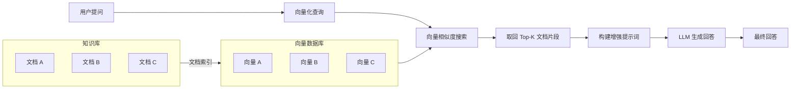
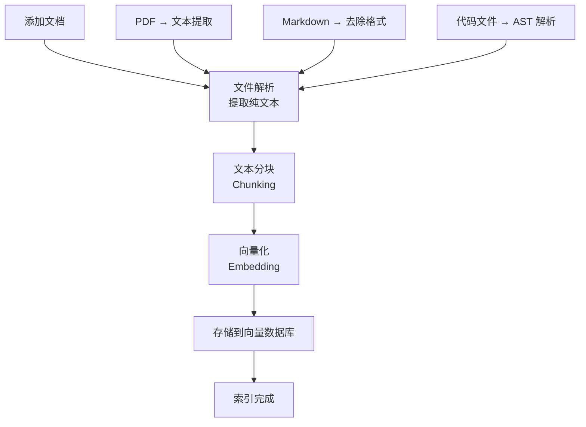

# 第五章：知识库管理

## 什么是 RAG？

**RAG（Retrieval-Augmented Generation，检索增强生成）** 是一种将外部知识注入到 LLM 回答过程中的技术。简单来说，它让 AI 不仅依赖预训练知识，还能从你提供的文档中检索相关信息来生成更准确的回答。

### RAG 的工作原理



### 为什么需要 RAG？

| 方式 | 优点 | 缺点 |
|------|------|------|
| 直接提问 LLM | 简单、快速 | 知识有截止日期，不了解你的私有数据 |
| 将文档塞入上下文 | 准确 | 上下文窗口有限，成本高 |
| **RAG** | 准确、经济、可扩展 | 需要预处理，检索质量影响回答 |

OpenClaw 内置了完整的 RAG 系统，让你无需了解底层技术细节即可使用知识库功能。

## 创建知识库

### 初始化知识库

```bash
# 创建一个新的知识库
openclaw kb create --name "工作文档"

# 查看已有的知识库
openclaw kb list

# 示例输出
# ID          Name        Documents  Last Updated
# kb_001      工作文档      0         2026-03-04
```

### 知识库配置

每个知识库都有独立的配置：

```yaml
# 知识库配置（创建时自动生成）
# ~/.openclaw/knowledge-bases/kb_001/config.yaml
name: "工作文档"
description: "公司内部文档和技术资料"

embedding:
  provider: "openai"           # 向量化模型提供商
  model: "text-embedding-3-small"  # 向量化模型
  dimensions: 1536             # 向量维度

chunking:
  strategy: "recursive"        # 分块策略
  chunk_size: 1000             # 每块最大字符数
  chunk_overlap: 200           # 块间重叠字符数
  separators:                  # 分块分隔符优先级
    - "\n## "
    - "\n### "
    - "\n\n"
    - "\n"
    - " "

retrieval:
  top_k: 5                    # 检索返回的文档块数量
  similarity_threshold: 0.7    # 相似度阈值
  rerank: true                 # 是否启用重排序

storage:
  type: "local"                # 存储类型：local 或 remote
  path: "~/.openclaw/knowledge-bases/kb_001/vectors"
```

## 文档索引

### 添加文档到知识库

```bash
# 添加单个文件
openclaw kb add kb_001 ~/Documents/tech-spec.md

# 添加整个目录
openclaw kb add kb_001 ~/Documents/project-docs/ --recursive

# 添加时指定文件类型过滤
openclaw kb add kb_001 ~/Documents/notes/ --include "*.md,*.txt"

# 添加时排除特定文件
openclaw kb add kb_001 ~/Projects/myapp/ --exclude "node_modules,dist,*.log"
```

添加文档后的处理流程：



### 支持的文档格式

| 格式 | 扩展名 | 解析方式 |
|------|--------|----------|
| Markdown | `.md` | 按标题层级分块 |
| 纯文本 | `.txt` | 按段落分块 |
| PDF | `.pdf` | 文本提取 + OCR |
| Word | `.docx` | 结构化提取 |
| HTML | `.html` | 去标签提取文本 |
| JSON | `.json` | 键值对展平 |
| CSV | `.csv` | 行级分块 |
| 代码文件 | `.py`, `.ts`, `.js` 等 | AST 感知分块 |
| Jupyter | `.ipynb` | Cell 级分块 |

### 查看索引状态

```bash
# 查看知识库详情
openclaw kb info kb_001

# 示例输出
# Knowledge Base: 工作文档 (kb_001)
# ─────────────────────────────
# Documents:    45
# Chunks:       1,234
# Total Tokens: 456,789
# Vector Size:  12.3 MB
# Last Updated: 2026-03-04 15:30:22
#
# Recent Documents:
#   tech-spec.md         (32 chunks, indexed 2h ago)
#   api-design.md        (18 chunks, indexed 2h ago)
#   meeting-notes-0301.md (12 chunks, indexed 1h ago)
```

## 查询知识库

### 在对话中使用知识库

```bash
# 启动对话时指定知识库
openclaw chat --kb kb_001

# 或在对话中切换知识库
/kb use kb_001
```

```
You > 我们的 API 认证方式是什么？

OpenClaw > [RAG: 检索到 3 个相关文档片段]
根据你的技术文档（tech-spec.md），你们的 API 认证采用
**JWT（JSON Web Token）+ API Key** 双重认证方式：

1. **API Key 认证**：用于服务间调用
   - 通过 `X-API-Key` 请求头传递
   - Key 由管理后台生成，支持权限范围控制

2. **JWT 认证**：用于用户端请求
   - 登录后获取 Access Token（有效期 2 小时）
   - 通过 Refresh Token 静默刷新（有效期 7 天）
   - Token 存储在 HttpOnly Cookie 中

参考文档：tech-spec.md 第 3.2 节"认证与授权"
```

### 精确查询与模糊查询

```
# 精确查询 - 寻找具体信息
You > 数据库连接池的最大连接数设置是多少？

# 模糊查询 - 探索性提问
You > 我们在性能优化方面做了哪些工作？

# 对比查询 - 交叉引用多个文档
You > 对比 v2.0 和 v3.0 的架构变更
```

### 查看检索来源

你可以要求 OpenClaw 显示回答所引用的文档来源：

```
You > /kb sources on

You > 公司的数据备份策略是什么？

OpenClaw > 根据运维手册，公司采用 **3-2-1 备份策略**：
...

📄 引用来源：
1. ops-manual.md [块 #23] (相似度: 0.92)
   "第五章 数据备份与恢复 - 5.1 备份策略..."
2. disaster-recovery.md [块 #7] (相似度: 0.85)
   "RTO 目标为 4 小时，RPO 目标为 1 小时..."
3. infra-architecture.md [块 #45] (相似度: 0.78)
   "备份存储使用 AWS S3，跨区域复制..."
```

## 知识库的更新与维护

### 更新已有文档

当源文件发生变化时，需要重新索引：

```bash
# 重新索引单个文件
openclaw kb update kb_001 ~/Documents/tech-spec.md

# 重新索引所有已变更的文件
openclaw kb sync kb_001

# 强制重建整个知识库索引
openclaw kb rebuild kb_001
```

### 增量同步

OpenClaw 支持基于文件修改时间的增量同步：

```bash
# 设置自动同步（每小时检查一次）
openclaw kb auto-sync kb_001 --interval 3600

# 查看同步状态
openclaw kb sync-status kb_001

# 示例输出
# Auto-sync: enabled (every 3600s)
# Last sync: 2026-03-04 15:00:00
# Files changed since last sync: 3
# - tech-spec.md (modified)
# - new-feature.md (new)
# - old-draft.md (deleted)
```

### 删除文档

```bash
# 从知识库中移除指定文档
openclaw kb remove kb_001 tech-spec.md

# 清空知识库中的所有文档
openclaw kb clear kb_001

# 删除整个知识库
openclaw kb delete kb_001
```

## 知识库组织的最佳实践

### 1. 按主题划分知识库

不要将所有文档放入一个知识库，而是按主题或用途分类：

```bash
# 创建多个专题知识库
openclaw kb create --name "技术文档"
openclaw kb create --name "产品需求"
openclaw kb create --name "会议纪要"
openclaw kb create --name "培训资料"
```

### 2. 优化文档质量

好的文档质量直接影响检索效果：

```markdown
<!-- 好的文档结构 -->
# API 认证设计

## 概述
本文档描述了 API 认证系统的设计方案。

## JWT 认证流程
1. 用户通过 /api/auth/login 获取 Token
2. Token 有效期为 2 小时
3. 通过 Refresh Token 可静默续期

## API Key 认证
- 通过管理后台生成
- 支持 IP 白名单限制
```

**最佳实践要点**：
- 使用清晰的标题层级
- 每个段落围绕一个主题
- 避免过长的段落（建议每段不超过 300 字）
- 使用列表和表格结构化信息

### 3. 调整分块参数

根据文档特点调整分块策略：

```yaml
# 短文档（FAQ、笔记）
chunking:
  chunk_size: 500
  chunk_overlap: 100

# 长文档（技术规范、手册）
chunking:
  chunk_size: 1500
  chunk_overlap: 300

# 代码文件
chunking:
  strategy: "ast_aware"   # 基于 AST 的智能分块
  chunk_size: 2000
```

### 4. 定期维护

```bash
# 查看知识库健康状况
openclaw kb health kb_001

# 示例输出
# Health Report for "技术文档" (kb_001)
# ────────────────────────────
# [PASS] Vector index integrity
# [WARN] 5 documents not synced (modified 3+ days ago)
# [WARN] 2 documents with low chunk quality score
# [PASS] Storage usage: 45 MB / 1 GB
#
# Recommendations:
# 1. Run 'openclaw kb sync kb_001' to update stale documents
# 2. Review chunking settings for large PDF files

# 优化向量索引
openclaw kb optimize kb_001
```

### 5. 多知识库联合查询

```bash
# 在对话中同时使用多个知识库
openclaw chat --kb kb_001,kb_002,kb_003

# 或在对话中动态添加
/kb add kb_002
/kb add kb_003
/kb list active
```

## 高级配置

### 自定义 Embedding 模型

如果你需要更好的中文检索效果，可以选择专门的中文 Embedding 模型：

```yaml
embedding:
  provider: "custom"
  endpoint: "http://localhost:11434/api/embeddings"
  model: "bge-large-zh-v1.5"
  dimensions: 1024
```

### 混合检索策略

OpenClaw 支持将向量检索与关键词检索结合，提升召回率：

```yaml
retrieval:
  strategy: "hybrid"      # hybrid: 混合检索
  vector_weight: 0.7      # 向量检索权重
  keyword_weight: 0.3     # 关键词检索权重
  top_k: 5
  rerank: true
  rerank_model: "bge-reranker-v2-m3"
```

## 本章小结

在本章中，你学习了：

1. **RAG 的基本概念**：通过检索增强让 LLM 具备私有知识
2. **知识库的创建与配置**：包括 Embedding 模型、分块策略等
3. **文档索引**：支持多种格式，自动处理文本提取和向量化
4. **知识库查询**：在对话中自然地检索和引用知识库内容
5. **维护与优化**：增量同步、健康检查、参数调优
6. **最佳实践**：按主题分类、优化文档质量、调整分块参数

---

> **上一章**：[本地文件管理](/guide/04-local-files) | **下一章**：[日程与任务管理](/guide/06-schedule-tasks)
