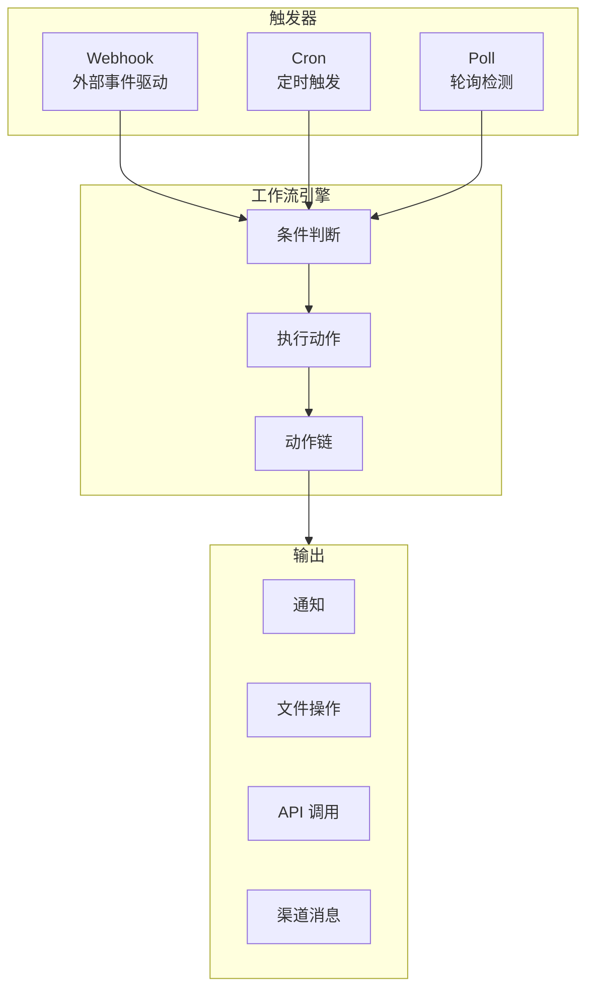

# 第七章：自动化工作流

## 三大触发类型

OpenClaw 的自动化工作流系统支持三种触发机制，覆盖了大部分自动化场景。



| 触发类型 | 原理 | 适用场景 | 实时性 |
|----------|------|----------|--------|
| **Webhook** | 外部系统主动推送事件 | GitHub PR、CI/CD 事件、支付通知 | 实时 |
| **Cron** | 按预设时间表执行 | 定期报告、数据备份、健康检查 | 按计划 |
| **Poll** | 定期轮询数据源检测变化 | 监控网页变化、检查邮件、库存监测 | 近实时 |

## Webhook 集成

### 什么是 Webhook？

Webhook 是一种"反向 API"机制——不是你去请求外部服务，而是外部服务在事件发生时主动向你的 OpenClaw 实例发送 HTTP 请求。

### 创建 Webhook 端点

```bash
# 创建一个 Webhook 端点
openclaw webhook create \
  --name "github-events" \
  --secret "your-webhook-secret"

# 输出
# Webhook created:
#   Name: github-events
#   URL: http://127.0.0.1:18789/webhooks/github-events
#   Secret: your-webhook-secret
#   Status: active
```

### Webhook 工作流配置

```yaml
# ~/.openclaw/workflows/github-pr-review.yaml
name: "GitHub PR 自动审查"
description: "当有新的 PR 时自动进行初步代码审查"

trigger:
  type: "webhook"
  endpoint: "github-events"
  filter:
    # 仅处理 PR 相关事件
    headers:
      X-GitHub-Event: "pull_request"
    body:
      action:
        - "opened"
        - "synchronize"

variables:
  pr_number: "{{ payload.pull_request.number }}"
  pr_title: "{{ payload.pull_request.title }}"
  repo: "{{ payload.repository.full_name }}"
  diff_url: "{{ payload.pull_request.diff_url }}"

action:
  type: "chain"
  steps:
    - name: "获取 PR diff"
      command: "gh pr diff {{ pr_number }} --repo {{ repo }}"
      output_var: "pr_diff"

    - name: "AI 代码审查"
      prompt: |
        请审查以下 Pull Request 的代码变更：

        仓库：{{ repo }}
        PR #{{ pr_number }}：{{ pr_title }}

        代码变更：
        ```
        {{ pr_diff }}
        ```

        请检查以下方面：
        1. 代码质量和可读性
        2. 潜在的 Bug 或安全问题
        3. 性能影响
        4. 是否有遗漏的测试

        以简洁的格式输出审查意见。
      output_var: "review_comment"

    - name: "发布评论"
      command: |
        gh pr comment {{ pr_number }} --repo {{ repo }} \
          --body "## 🤖 OpenClaw 自动审查\n\n{{ review_comment }}"

output:
  channels:
    - type: "slack"
      channel: "#code-reviews"
      message: "已完成 PR #{{ pr_number }} ({{ pr_title }}) 的自动审查"
```

### 在 GitHub 中配置 Webhook

1. 进入 GitHub 仓库设置 → Webhooks → Add webhook
2. 填写配置：

```
Payload URL: https://your-domain.com/webhooks/github-events
Content type: application/json
Secret: your-webhook-secret
Events: Pull requests, Pushes, Issues
```

::: tip 本地开发提示
如果你的 OpenClaw 运行在本地，可以使用 `ngrok` 或 `cloudflared` 创建公网隧道：
```bash
# 使用 cloudflared 创建隧道
cloudflared tunnel --url http://localhost:18789
```
:::

## 事件驱动自动化

### 内部事件系统

除了外部 Webhook，OpenClaw 还有内部事件系统，你可以监听 OpenClaw 自身的事件：

```yaml
# 当会话结束时自动保存摘要
name: "会话摘要归档"
trigger:
  type: "event"
  source: "openclaw"
  event: "session.ended"
  filter:
    session_duration_min: 300  # 仅处理超过 5 分钟的会话

action:
  type: "prompt"
  prompt: |
    请对以下会话生成摘要：
    - 会话ID：{{ event.session_id }}
    - 持续时间：{{ event.duration }}秒
    - 消息数：{{ event.message_count }}

    总结主要讨论内容和得出的结论，保存到
    ~/Documents/session-summaries/ 目录。
```

### 事件类型参考

| 事件类型 | 说明 | 载荷内容 |
|----------|------|----------|
| `session.started` | 新会话开始 | session_id, user |
| `session.ended` | 会话结束 | session_id, duration, message_count |
| `skill.executed` | Skill 执行完毕 | skill_name, result, duration |
| `file.modified` | 监控的文件被修改 | file_path, change_type |
| `task.completed` | 定时任务执行完成 | task_id, status, output |
| `task.failed` | 定时任务执行失败 | task_id, error |
| `kb.updated` | 知识库更新 | kb_id, documents_changed |

## Poll 轮询触发

Poll 触发器适用于没有 Webhook 支持的外部数据源。

### 基本 Poll 配置

```yaml
# 监控竞品价格变化
name: "竞品价格监控"
trigger:
  type: "poll"
  interval: 3600  # 每小时检查一次
  source:
    type: "url"
    url: "https://api.competitor.com/products/pricing"
    headers:
      Accept: "application/json"

  # 变化检测
  change_detection:
    strategy: "json_diff"
    watch_fields:
      - "products[*].price"
      - "products[*].status"

action:
  type: "prompt"
  prompt: |
    竞品价格发生变化：
    之前的数据：{{ previous_data }}
    当前的数据：{{ current_data }}

    请分析价格变化幅度和可能的原因，给出我们的应对建议。

output:
  channels:
    - type: "slack"
      channel: "#pricing-alerts"
```

### 监控网页内容变化

```yaml
# 监控文档更新
name: "文档更新监控"
trigger:
  type: "poll"
  interval: 1800  # 每 30 分钟
  source:
    type: "webpage"
    url: "https://docs.example.com/changelog"
    selector: "#changelog .entry:first-child"  # CSS 选择器

  change_detection:
    strategy: "text_diff"
    threshold: 0.1  # 文本变化超过 10% 时触发

action:
  type: "prompt"
  prompt: |
    检测到文档更新：
    {{ change_summary }}

    请总结变更内容，评估是否影响我们的集成。
```

### 监控文件系统变化

```yaml
# 监控配置文件变更
name: "配置变更审计"
trigger:
  type: "poll"
  interval: 60  # 每分钟
  source:
    type: "filesystem"
    paths:
      - ~/Projects/myapp/config/
    watch_patterns:
      - "*.yaml"
      - "*.json"
      - "*.env.*"

action:
  type: "chain"
  steps:
    - name: "记录变更"
      prompt: |
        配置文件发生变更：
        文件：{{ changed_file }}
        变更类型：{{ change_type }}
        请记录此变更到审计日志。
    - name: "验证配置"
      prompt: "检查变更后的配置文件是否有语法错误或安全风险"
```

## 动作链（Action Chaining）

动作链允许你将多个步骤串联成复杂的工作流。

### 基本链式结构

```yaml
action:
  type: "chain"
  steps:
    - name: "步骤一"
      prompt: "..."
      output_var: "step1_result"

    - name: "步骤二"
      prompt: "基于上一步结果：{{ step1_result }}，继续处理..."
      output_var: "step2_result"

    - name: "步骤三"
      condition: "{{ step2_result.status == 'needs_action' }}"
      prompt: "仅在条件满足时执行..."
```

### 并行执行

```yaml
action:
  type: "parallel"  # 并行执行所有步骤
  steps:
    - name: "检查服务 A"
      command: "curl -s https://api-a.example.com/health"
      output_var: "service_a"

    - name: "检查服务 B"
      command: "curl -s https://api-b.example.com/health"
      output_var: "service_b"

    - name: "检查服务 C"
      command: "curl -s https://api-c.example.com/health"
      output_var: "service_c"

  # 所有并行步骤完成后执行
  then:
    - name: "汇总报告"
      prompt: |
        服务健康检查结果：
        - 服务 A：{{ service_a }}
        - 服务 B：{{ service_b }}
        - 服务 C：{{ service_c }}
        请生成汇总报告。
```

### 条件分支

```yaml
action:
  type: "chain"
  steps:
    - name: "检测问题"
      prompt: "检查服务状态，判断是否需要干预"
      output_var: "diagnosis"

    - name: "自动修复"
      condition: "{{ diagnosis.severity == 'low' }}"
      prompt: "尝试自动重启服务..."

    - name: "人工告警"
      condition: "{{ diagnosis.severity == 'high' }}"
      type: "notify"
      channels:
        - type: "slack"
          channel: "#oncall"
          message: "紧急：{{ diagnosis.description }}"
        - type: "system"
          sound: true
```

## 实战自动化案例

### 案例一：新员工入职自动化

```yaml
name: "新员工入职流程"
trigger:
  type: "webhook"
  endpoint: "hr-system"
  filter:
    body:
      event_type: "new_hire"

variables:
  name: "{{ payload.employee.name }}"
  email: "{{ payload.employee.email }}"
  department: "{{ payload.employee.department }}"
  start_date: "{{ payload.employee.start_date }}"

action:
  type: "chain"
  steps:
    - name: "创建欢迎文档"
      prompt: |
        为新员工 {{ name }}（{{ department }}）生成入职欢迎文档，
        包含团队介绍、常用工具链接、第一周学习计划。
        保存到 ~/HR/onboarding/{{ name }}.md

    - name: "设置日历提醒"
      prompt: |
        在 {{ start_date }} 创建以下日历事件：
        - 09:00 新员工欢迎会
        - 10:00 IT 设备领取
        - 14:00 团队介绍会

    - name: "通知相关人员"
      type: "notify"
      channels:
        - type: "slack"
          channel: "#{{ department }}"
          message: "欢迎 {{ name }} 加入团队！入职日期：{{ start_date }}"
```

### 案例二：CI/CD 失败自动分析

```yaml
name: "CI 失败自动诊断"
trigger:
  type: "webhook"
  endpoint: "github-events"
  filter:
    headers:
      X-GitHub-Event: "check_run"
    body:
      action: "completed"
      check_run:
        conclusion: "failure"

variables:
  repo: "{{ payload.repository.full_name }}"
  branch: "{{ payload.check_run.head_branch }}"
  run_id: "{{ payload.check_run.id }}"

action:
  type: "chain"
  steps:
    - name: "获取失败日志"
      command: "gh run view {{ run_id }} --repo {{ repo }} --log-failed"
      output_var: "failure_log"

    - name: "AI 诊断"
      prompt: |
        CI/CD 构建失败，请分析原因：
        仓库：{{ repo }}
        分支：{{ branch }}
        失败日志：
        ```
        {{ failure_log }}
        ```
        请：1. 识别根本原因 2. 提供修复建议 3. 评估影响范围
      output_var: "diagnosis"

    - name: "发布诊断结果"
      command: |
        gh pr comment --repo {{ repo }} \
          --body "## 🔍 CI 失败自动诊断\n\n{{ diagnosis }}"
```

### 案例三：每日数据管道

```yaml
name: "数据日报管道"
schedule:
  cron: "0 7 * * *"
  timezone: "Asia/Shanghai"

action:
  type: "chain"
  steps:
    - name: "拉取销售数据"
      command: "curl -s https://api.internal.com/sales/daily | jq '.'"
      output_var: "sales_data"

    - name: "拉取用户数据"
      command: "curl -s https://api.internal.com/users/metrics | jq '.'"
      output_var: "user_data"

    - name: "生成分析报告"
      prompt: |
        基于以下数据生成日报分析：
        销售数据：{{ sales_data }}
        用户数据：{{ user_data }}
        包含：核心指标、同比环比、异常检测、行动建议
      output_var: "report"

    - name: "保存并分发"
      prompt: |
        1. 将报告保存到 ~/Reports/daily/{{ date }}.md
        2. 发送摘要到 Slack #data-insights
        3. 如有异常指标，额外通知 #alerts
```

## 错误处理

### 重试机制

```yaml
action:
  type: "chain"
  error_handling:
    retry:
      max_attempts: 3
      delay: 60           # 重试间隔（秒）
      backoff: "exponential"  # 指数退避：60s, 120s, 240s

    on_failure:
      type: "notify"
      channels:
        - type: "slack"
          channel: "#workflow-errors"
          message: |
            工作流 "{{ workflow.name }}" 执行失败
            错误信息：{{ error.message }}
            已重试 {{ error.attempts }} 次
```

### 超时控制

```yaml
action:
  type: "chain"
  timeout: 300  # 整个工作流超时时间（秒）

  steps:
    - name: "耗时操作"
      timeout: 120  # 单步超时时间
      prompt: "..."

      on_timeout:
        type: "fallback"
        prompt: "上一步超时了，请使用简化方案处理..."
```

### 错误日志与调试

```bash
# 查看工作流执行日志
openclaw workflow logs <workflow-id> --verbose

# 调试模式运行
openclaw workflow run <workflow-id> --debug --dry-run

# dry-run 模式不会实际执行动作，仅输出计划执行的步骤
```

## 工作流管理命令

```bash
# 工作流列表
openclaw workflow list
openclaw workflow list --status active

# 工作流操作
openclaw workflow create -f workflow.yaml  # 从文件创建
openclaw workflow enable <id>              # 启用
openclaw workflow disable <id>             # 停用
openclaw workflow run <id>                 # 手动触发一次
openclaw workflow delete <id>              # 删除

# Webhook 管理
openclaw webhook list                      # 列出所有端点
openclaw webhook test <name>               # 发送测试请求
openclaw webhook logs <name> --last 20     # 查看最近请求日志
```

## 本章小结

在本章中，你学习了：

1. **三大触发类型**：Webhook（事件驱动）、Cron（定时）、Poll（轮询）
2. **Webhook 集成**：创建端点、配置 GitHub 等外部服务、处理事件
3. **事件驱动自动化**：内部事件系统和外部事件的响应
4. **Poll 轮询**：监控网页、API、文件系统的变化
5. **动作链**：链式执行、并行处理、条件分支
6. **错误处理**：重试机制、超时控制、日志调试

---

> **上一章**：[日程与任务管理](/guide/06-schedule-tasks) | **下一章**：[进阶用法](/guide/08-advanced)
