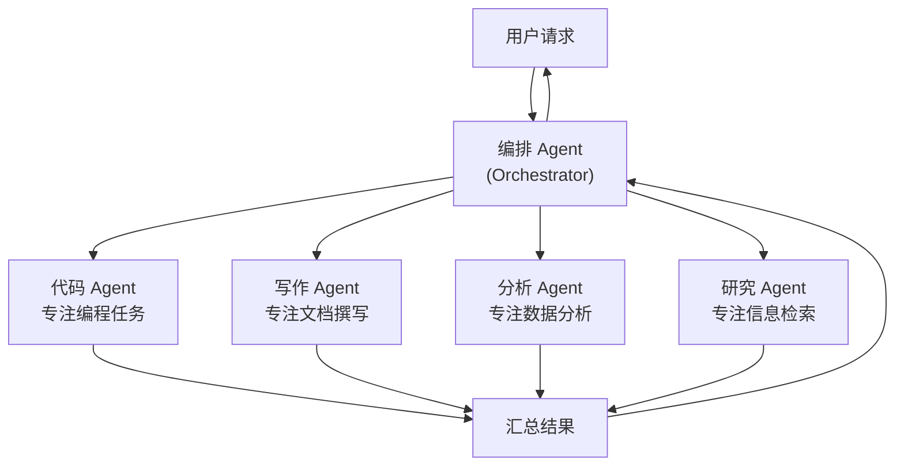
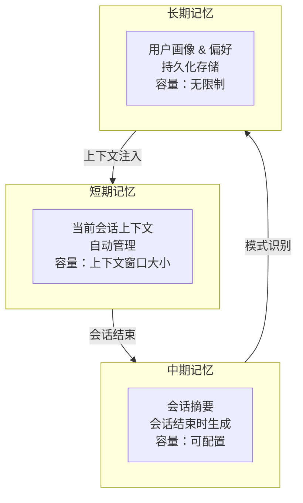
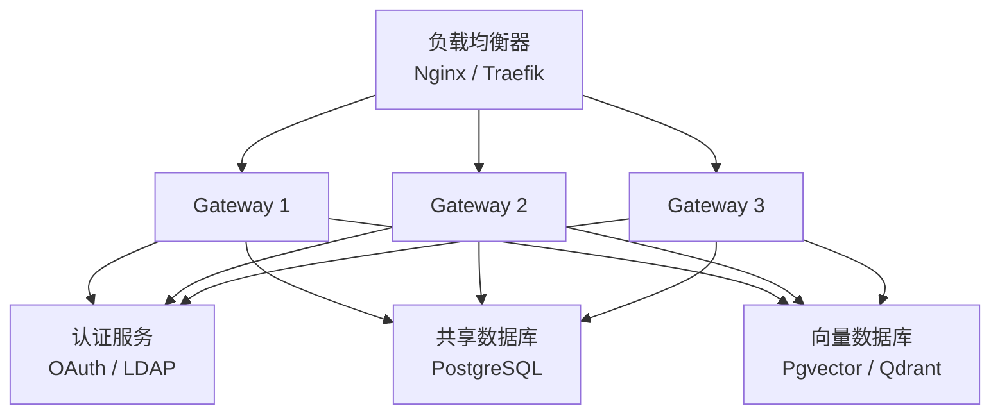

# 第八章：进阶用法

## 多 Agent 协作

在复杂场景下，单个 Agent 可能无法高效地完成所有任务。OpenClaw 支持**多 Agent 协作模式**，让多个专业化的 Agent 协同工作。

### 多 Agent 架构



### 配置多 Agent

```yaml
# ~/.openclaw/agents/multi-agent.yaml
orchestrator:
  name: "主编排器"
  model: "gpt-4o"
  system_prompt: |
    你是一个任务编排器。收到用户请求后，请分析任务并分配给合适的专业 Agent。
    你可以调用的 Agent：coder, writer, analyst, researcher。
    所有 Agent 完成后，请汇总结果并以统一格式返回给用户。

agents:
  coder:
    name: "代码专家"
    model: "claude-sonnet-4-20250514"
    system_prompt: |
      你是一个资深软件工程师。专注于代码编写、审查和重构。
      始终提供可运行的代码示例，包含完整的类型定义和错误处理。
    skills:
      - filesystem
      - git
      - code-runner
    temperature: 0.3

  writer:
    name: "技术写手"
    model: "gpt-4o"
    system_prompt: |
      你是一个技术写作专家。善于撰写清晰、结构化的技术文档。
      使用准确的术语，配合图表和示例。
    skills:
      - filesystem
      - knowledge-base
    temperature: 0.7

  analyst:
    name: "数据分析师"
    model: "gpt-4o"
    system_prompt: |
      你是一个数据分析专家。善于数据清洗、统计分析和可视化。
      总是提供数据支撑的结论和可视化建议。
    skills:
      - filesystem
      - data-tools
      - chart-generator
    temperature: 0.2

  researcher:
    name: "信息研究员"
    model: "gpt-4o-mini"
    system_prompt: |
      你是一个信息研究助手。善于从知识库和网络中检索、整理信息。
      总是标注信息来源，区分事实与推测。
    skills:
      - knowledge-base
      - web-search
    temperature: 0.5
```

### 启动多 Agent 模式

```bash
# 使用多 Agent 配置启动对话
openclaw chat --agents multi-agent

# 在对话中查看 Agent 状态
/agents status
```

### 多 Agent 协作示例

```
You > 请帮我为我们的 REST API 生成完整的技术文档，
      包含 API 规范、代码示例和性能基准测试。

Orchestrator > 收到！我将此任务分配给 3 个 Agent 并行处理：

[Researcher] 正在检索知识库中的 API 相关文档...
[Coder] 正在分析 ~/Projects/api-server/src/routes/ 代码...
[Analyst] 正在收集 API 性能监控数据...

--- 2 分钟后 ---

[Writer] 基于以上信息，正在撰写技术文档...

--- 完成 ---

技术文档已生成并保存到 ~/Documents/api-docs/：
1. api-reference.md - API 接口规范（42 个端点）
2. code-examples.md - 各语言调用示例
3. performance-report.md - 性能基准测试报告

总耗时：3 分 22 秒 | 使用 Token：12,345
```

### 多 Agent 通信模式

| 模式 | 描述 | 适用场景 |
|------|------|----------|
| **集中式** | 所有 Agent 通过 Orchestrator 通信 | 任务分解明确、结果需汇总 |
| **链式** | Agent A 的输出传给 Agent B | 流水线处理 |
| **广播** | 同一输入发给所有 Agent | 多角度分析 |
| **投票** | 多个 Agent 独立处理，取多数结果 | 提高准确性 |

```yaml
# 链式通信示例
collaboration:
  mode: "chain"
  pipeline:
    - agent: "researcher"
      task: "收集相关资料"
    - agent: "analyst"
      task: "分析数据趋势"
      input: "{{ researcher.output }}"
    - agent: "writer"
      task: "撰写报告"
      input: "{{ analyst.output }}"
```

## 自定义 Skill 开发

### Skill 基本概念

Skill 是 OpenClaw 的功能扩展单元。每个 Skill 就是一个独立的功能模块，可以被 Agent 调用来完成特定任务。

### SKILL.md 格式

每个 Skill 项目必须包含一个 `SKILL.md` 文件，这是 Skill 的元数据和文档：

```markdown
---
name: weather-query
version: 1.0.0
description: 查询全球各地的天气信息
author: your-username
license: MIT
tags:
  - weather
  - utility
  - api
requires:
  - node: ">=22.0.0"
  - api_key: WEATHER_API_KEY
parameters:
  - name: location
    type: string
    required: true
    description: 查询的城市或地区名称
  - name: unit
    type: string
    required: false
    default: "celsius"
    enum: ["celsius", "fahrenheit"]
    description: 温度单位
returns:
  type: object
  properties:
    temperature: number
    humidity: number
    description: string
    forecast: array
---

# Weather Query Skill

查询全球各地的实时天气信息和未来 7 天预报。

## 使用示例

```
查询北京今天的天气
未来三天上海的天气预报
```

## API Key 获取

1. 访问 https://weatherapi.com
2. 注册账号获取免费 API Key
3. 配置：`openclaw config set skills.weather-query.api_key YOUR_KEY`
```

### Skill 项目结构

```
weather-query/
├── SKILL.md              # Skill 元数据和文档
├── package.json          # Node.js 依赖
├── src/
│   ├── index.ts          # 入口文件
│   ├── api.ts            # API 调用封装
│   └── types.ts          # 类型定义
├── tests/
│   ├── index.test.ts     # 单元测试
│   └── fixtures/         # 测试数据
└── README.md             # 开发文档
```

### 实现一个 Skill

```typescript
// src/index.ts
import { Skill, SkillContext, SkillResult } from '@openclaw/sdk';

interface WeatherParams {
  location: string;
  unit?: 'celsius' | 'fahrenheit';
}

interface WeatherData {
  temperature: number;
  humidity: number;
  description: string;
  forecast: Array<{
    date: string;
    high: number;
    low: number;
    description: string;
  }>;
}

export default class WeatherSkill extends Skill<WeatherParams, WeatherData> {
  name = 'weather-query';

  async execute(
    params: WeatherParams,
    context: SkillContext
  ): Promise<SkillResult<WeatherData>> {
    const apiKey = context.config.get('api_key');
    if (!apiKey) {
      return this.error('未配置 WEATHER_API_KEY，请先设置 API Key');
    }

    const { location, unit = 'celsius' } = params;

    try {
      const response = await fetch(
        `https://api.weatherapi.com/v1/forecast.json` +
        `?key=${apiKey}&q=${encodeURIComponent(location)}&days=7`
      );

      if (!response.ok) {
        return this.error(`天气查询失败: ${response.statusText}`);
      }

      const data = await response.json();
      const current = data.current;
      const forecast = data.forecast.forecastday;

      const temp = unit === 'celsius' ? current.temp_c : current.temp_f;

      return this.success({
        temperature: temp,
        humidity: current.humidity,
        description: current.condition.text,
        forecast: forecast.map((day: any) => ({
          date: day.date,
          high: unit === 'celsius' ? day.day.maxtemp_c : day.day.maxtemp_f,
          low: unit === 'celsius' ? day.day.mintemp_c : day.day.mintemp_f,
          description: day.day.condition.text,
        })),
      });
    } catch (err) {
      return this.error(`网络请求失败: ${(err as Error).message}`);
    }
  }
}
```

### 测试 Skill

```bash
# 运行单元测试
cd weather-query
npm test

# 本地测试执行
openclaw skill test ./weather-query --params '{"location": "北京"}'

# 预期输出
# Skill: weather-query v1.0.0
# Input: { location: "北京" }
# Output: {
#   temperature: 12,
#   humidity: 45,
#   description: "晴",
#   forecast: [...]
# }
# Duration: 234ms
# Status: success
```

## 发布到 ClawHub

**ClawHub** 是 OpenClaw 的官方 Skill 注册中心，类似于 npm 或 PyPI。

### 发布流程

```bash
# 1. 登录 ClawHub
openclaw hub login

# 2. 验证 Skill 格式
openclaw skill validate ./weather-query

# 验证输出：
# [PASS] SKILL.md format is valid
# [PASS] Package structure is correct
# [PASS] Entry point exists
# [PASS] Tests pass (3/3)
# [PASS] No security issues detected
# Ready to publish!

# 3. 发布
openclaw skill publish ./weather-query

# 发布输出：
# Publishing weather-query@1.0.0 to ClawHub...
# Package uploaded successfully!
# URL: https://hub.openclaw.dev/skills/weather-query
```

### 版本管理

```bash
# 更新版本
openclaw skill bump ./weather-query --patch   # 1.0.0 -> 1.0.1
openclaw skill bump ./weather-query --minor   # 1.0.0 -> 1.1.0
openclaw skill bump ./weather-query --major   # 1.0.0 -> 2.0.0

# 发布新版本
openclaw skill publish ./weather-query

# 查看已发布的版本
openclaw hub versions weather-query
```

### ClawHub 统计

```bash
# 查看 Skill 下载统计
openclaw hub stats weather-query

# 输出：
# weather-query@1.0.0
# Downloads: 1,234 (total) | 89 (this week)
# Stars: 56
# Reviews: 4.5/5.0 (12 reviews)
```

## 性能优化

### Token 使用优化

```yaml
# ~/.openclaw/config.yaml
performance:
  # 上下文压缩 - 自动压缩过长的对话历史
  context_compression:
    enabled: true
    strategy: "summarize"    # summarize: 自动摘要, truncate: 截断
    trigger_threshold: 0.8   # 上下文占用率达到 80% 时触发
    target_ratio: 0.5        # 压缩到 50%

  # 智能路由 - 根据任务复杂度选择模型
  smart_routing:
    enabled: true
    rules:
      - condition: "simple_qa"       # 简单问答
        model: "gpt-4o-mini"         # 用小模型
      - condition: "code_generation"  # 代码生成
        model: "claude-sonnet-4-20250514"       # 用强模型
      - condition: "data_analysis"    # 数据分析
        model: "gpt-4o"              # 用通用强模型

  # 缓存 - 缓存重复查询结果
  cache:
    enabled: true
    ttl: 3600                # 缓存有效期（秒）
    max_size: "500MB"        # 最大缓存空间
    strategy: "semantic"     # semantic: 语义相似的查询也命中缓存
```

### 响应速度优化

```yaml
performance:
  streaming:
    enabled: true            # 启用流式响应
    chunk_size: 10           # 每次推送的 token 数

  prefetch:
    enabled: true            # 预加载常用 Skills
    skills:
      - filesystem
      - knowledge-base
      - code-runner

  connection_pool:
    max_connections: 10      # 最大并发连接数
    keep_alive: true         # 保持连接
    timeout: 30000           # 连接超时（毫秒）
```

### 性能监控

```bash
# 查看性能统计
openclaw perf stats

# 输出示例：
# Performance Statistics (last 24h)
# ─────────────────────────────
# Total requests:     234
# Avg response time:  1.2s
# P95 response time:  3.4s
# P99 response time:  8.1s
# Token usage:        45,678
# Cache hit rate:     34%
#
# Model breakdown:
#   gpt-4o:         89 requests, avg 2.1s
#   gpt-4o-mini:    120 requests, avg 0.6s
#   claude-sonnet:  25 requests, avg 1.8s

# 导出详细性能报告
openclaw perf export --format csv --output ~/perf-report.csv
```

## 记忆系统调优

### 记忆层级

OpenClaw 的记忆系统分为三个层级：



### 记忆配置

```yaml
# ~/.openclaw/config.yaml
memory:
  short_term:
    type: "sliding_window"   # 滑动窗口
    max_messages: 50         # 保留最近 50 条消息
    max_tokens: 8000         # 或最多 8000 tokens

  mid_term:
    enabled: true
    auto_summarize: true     # 会话结束自动生成摘要
    max_summaries: 100       # 保留最近 100 个会话摘要
    storage: "local"         # 存储位置

  long_term:
    enabled: true
    user_profile: true       # 自动学习用户偏好
    facts_extraction: true   # 自动提取事实信息
    storage: "local"
    max_facts: 1000          # 最多存储 1000 条事实

    # 事实示例
    # - "用户使用 MacBook Pro M3"
    # - "用户偏好 TypeScript"
    # - "用户的项目使用 React + Vite"
    # - "用户在 XXX 公司工作"
```

### 记忆管理命令

```bash
# 查看记忆内容
openclaw memory show --type long_term

# 编辑长期记忆
openclaw memory edit --type long_term

# 清除特定记忆
openclaw memory forget "用户在 XXX 公司工作"

# 导出所有记忆
openclaw memory export --output ~/memory-backup.json

# 导入记忆
openclaw memory import ~/memory-backup.json
```

## 企业部署

### 多用户部署架构



### 企业级配置

```yaml
# openclaw-enterprise.yaml
deployment:
  mode: "enterprise"
  replicas: 3

auth:
  provider: "oauth2"
  issuer: "https://auth.company.com"
  client_id: "openclaw-prod"
  scopes:
    - "openid"
    - "profile"
    - "email"

  # 角色权限控制
  rbac:
    roles:
      admin:
        permissions: ["*"]
      developer:
        permissions: ["chat", "skills", "kb.read", "kb.write", "files.read"]
      viewer:
        permissions: ["chat", "kb.read"]

database:
  type: "postgresql"
  host: "db.internal.company.com"
  port: 5432
  database: "openclaw"
  ssl: true

vector_store:
  type: "qdrant"
  host: "qdrant.internal.company.com"
  port: 6333

logging:
  level: "info"
  output: "json"
  destination: "stdout"  # 方便 ELK 收集

  # 审计日志
  audit:
    enabled: true
    log_prompts: false    # 不记录用户输入内容（隐私保护）
    log_metadata: true    # 记录操作元数据

monitoring:
  prometheus:
    enabled: true
    port: 9090
  health_check:
    endpoint: "/health"
    interval: 30
```

### Docker Compose 企业部署

```yaml
# docker-compose.enterprise.yml
version: '3.8'
services:
  openclaw-gateway:
    image: openclaw/openclaw:latest
    deploy:
      replicas: 3
      resources:
        limits:
          cpus: '2.0'
          memory: 4G
    ports:
      - "18789:18789"
    environment:
      - OPENCLAW_CONFIG=/config/openclaw-enterprise.yaml
      - DATABASE_URL=postgresql://user:pass@db:5432/openclaw
    volumes:
      - ./config:/config:ro
    depends_on:
      - db
      - qdrant

  db:
    image: pgvector/pgvector:pg16
    volumes:
      - pgdata:/var/lib/postgresql/data
    environment:
      POSTGRES_DB: openclaw
      POSTGRES_USER: openclaw
      POSTGRES_PASSWORD: ${DB_PASSWORD}

  qdrant:
    image: qdrant/qdrant:latest
    volumes:
      - qdrant_data:/qdrant/storage

  nginx:
    image: nginx:alpine
    ports:
      - "443:443"
    volumes:
      - ./nginx.conf:/etc/nginx/nginx.conf:ro
      - ./certs:/etc/nginx/certs:ro
    depends_on:
      - openclaw-gateway

volumes:
  pgdata:
  qdrant_data:
```

### 安全加固清单

| 检查项 | 说明 | 状态 |
|--------|------|------|
| HTTPS 加密 | 所有通信启用 TLS | 必须 |
| 认证授权 | OAuth2/LDAP 集成 | 必须 |
| API Key 加密存储 | 使用 Vault 等密钥管理工具 | 推荐 |
| 审计日志 | 记录所有操作 | 必须 |
| 网络隔离 | 内部服务不暴露公网 | 推荐 |
| 速率限制 | 防止 API 滥用 | 推荐 |
| 数据加密 | 静态数据加密 | 推荐 |
| 定期备份 | 数据库和知识库备份 | 必须 |

## 本章小结

在本章中，你学习了 OpenClaw 的进阶功能：

1. **多 Agent 协作**：编排多个专业化 Agent 协同完成复杂任务
2. **自定义 Skill 开发**：SKILL.md 格式、项目结构、实现和测试
3. **ClawHub 发布**：将 Skill 发布到社区注册中心
4. **性能优化**：Token 优化、智能路由、缓存策略
5. **记忆系统调优**：三级记忆架构的配置和管理
6. **企业部署**：多实例部署、权限控制、安全加固

恭喜你完成了 Learn OpenClaw 的全部 8 章学习内容！你现在已经具备了从入门到精通使用 OpenClaw 的完整知识体系。

---

> **上一章**：[自动化工作流](/guide/07-automation) | **回到首页**：[Learn OpenClaw](/)
