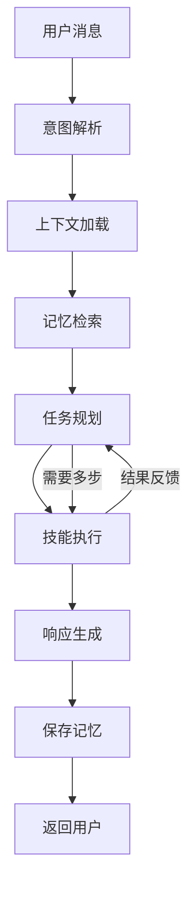
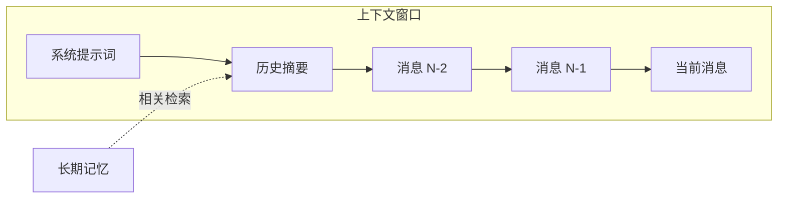

# Agent 参考

Agent 是 OpenClaw 的智能核心，负责理解用户意图、调用技能、管理上下文，并生成最终响应。每个用户会话对应一个 Agent 实例。

## Agent 处理流程



## 生命周期

Agent 的生命周期与用户会话（Session）绑定：

1. **创建** - 用户首次发送消息时，Gateway 创建 Agent 实例
2. **活跃** - Agent 处理消息、维护上下文和记忆
3. **休眠** - 超过空闲时间后，Agent 状态序列化到存储
4. **恢复** - 用户再次发消息时，从存储恢复状态
5. **销毁** - 会话过期后，Agent 实例被回收

## 配置选项

```yaml
agent:
  model: gpt-4o
  temperature: 0.7
  maxTokens: 4096
  systemPrompt: |
    你是一个友好的 AI 助手，名叫 Claw。
  persona: friendly
  language: zh-CN
context:
  windowSize: 20
  maxContextTokens: 8000
  summaryThreshold: 15
memory:
  shortTerm: { enabled: true, maxItems: 50 }
  longTerm: { enabled: true, storage: vector }
  episodic: { enabled: true, maxEpisodes: 100 }
session:
  idleTimeout: 1800
  maxDuration: 86400
```

| 配置项 | 类型 | 默认值 | 说明 |
|--------|------|--------|------|
| `agent.model` | string | `gpt-4o` | 使用的 LLM 模型 |
| `agent.temperature` | number | `0.7` | 生成温度（0-2） |
| `agent.maxTokens` | number | `4096` | 最大输出 Token 数 |
| `agent.systemPrompt` | string | - | 系统提示词 |
| `agent.persona` | string | `friendly` | 人设：friendly/professional/casual |
| `context.windowSize` | number | `20` | 上下文窗口消息数 |
| `context.maxContextTokens` | number | `8000` | 上下文最大 Token 数 |
| `context.summaryThreshold` | number | `15` | 触发摘要的消息数阈值 |
| `memory.shortTerm.maxItems` | number | `50` | 短期记忆最大条数 |
| `memory.longTerm.storage` | string | `vector` | 长期记忆存储方式 |
| `session.idleTimeout` | number | `1800` | 空闲超时（秒） |
| `session.maxDuration` | number | `86400` | 会话最大时长（秒） |

## 上下文窗口管理



- 当消息数超过 `summaryThreshold` 时，自动对早期消息生成摘要
- 摘要与最近的消息一起构成上下文窗口
- 总 Token 数不超过 `maxContextTokens`

## 记忆系统

| 记忆类型 | 存储周期 | 用途 | 示例 |
|----------|----------|------|------|
| **短期记忆** | 当前会话 | 维持对话连贯性 | 用户刚提到的偏好 |
| **长期记忆** | 永久 | 存储用户画像和事实 | 用户的名字、工作信息 |
| **情景记忆** | 永久 | 记录重要交互事件 | 上次请求的任务结果 |

## 多 Agent 协作

```yaml
agents:
  - name: coordinator
    role: 任务分发和结果汇总
    model: gpt-4o
    canDelegate: [researcher, writer]
  - name: researcher
    role: 信息检索和分析
    skills: [web-search, doc-reader]
  - name: writer
    role: 内容生成和编辑
    skills: [text-writer, formatter]
```

coordinator 负责理解用户需求并将子任务分配给专门的 Agent，最后汇总结果返回用户。

## 常用命令

```bash
openclaw agent list                              # 查看活跃 Agent
openclaw agent status --id <agent-id>            # 查看状态
openclaw agent reset --id <agent-id> --memory    # 重置记忆
openclaw agent export --id <agent-id> -o backup.yaml  # 导出配置
```
