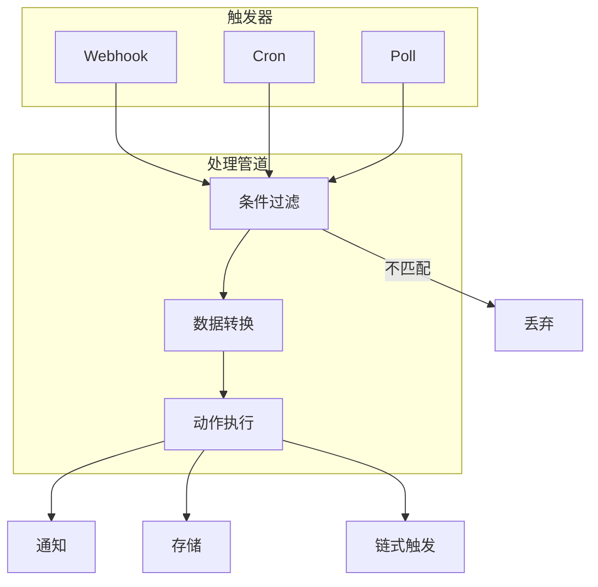

# Automation 参考

Automation 是 OpenClaw 的事件驱动执行引擎，支持 Webhook、Cron 和 Poll 三种触发方式实现自动化工作流。

## 三种触发方式对比

| 特性 | Webhook | Cron | Poll |
|------|---------|------|------|
| 触发方式 | 外部 HTTP 请求 | 定时调度 | 定期轮询数据源 |
| 实时性 | 实时 | 按计划 | 准实时 |
| 适用场景 | 事件驱动、第三方集成 | 定期任务、报表 | 监控变更、数据同步 |
| 示例 | GitHub Push 触发审查 | 每日 9 点发天气 | 每 5 分钟检查邮件 |

## 工作流架构



## Webhook 配置

```yaml
automations:
  - name: github-code-review
    trigger:
      type: webhook
      path: /hook/github-review
      method: POST
      secret: "${GITHUB_WEBHOOK_SECRET}"
    filter:
      conditions:
        - field: "body.ref"
          operator: equals
          value: "refs/heads/main"
    actions:
      - type: agent
        prompt: "请审查以下代码变更：{{body.commits}}"
      - type: notify
        channel: slack
        target: "#code-review"
```

| 验证方式 | 配置字段 | 说明 |
|----------|----------|------|
| HMAC 签名 | `secret` | 共享密钥验证签名 |
| IP 白名单 | `allowedIPs` | 限制来源 IP |
| Bearer Token | `bearerToken` | 验证 Authorization 头 |

## Cron 定时任务

```yaml
automations:
  - name: daily-weather-report
    trigger:
      type: cron
      expression: "0 9 * * *"
      timezone: Asia/Shanghai
    actions:
      - type: skill
        name: weather-query
        inputs: { city: "上海", days: 3 }
      - type: notify
        channel: telegram
        target: "${MY_CHAT_ID}"
        template: "早安！今日天气：{{skill.result.summary}}"
```

### Cron 表达式速查

| 表达式 | 含义 |
|--------|------|
| `0 9 * * *` | 每天 9:00 |
| `0 9 * * 1-5` | 工作日 9:00 |
| `*/5 * * * *` | 每 5 分钟 |
| `0 9,18 * * *` | 每天 9:00 和 18:00 |
| `0 0 1 * *` | 每月 1 号 0:00 |

格式：`分 时 日 月 周`

## Poll 轮询配置

```yaml
automations:
  - name: email-monitor
    trigger:
      type: poll
      interval: 300
      source:
        type: imap
        host: imap.gmail.com
        user: "${EMAIL_USER}"
        password: "${EMAIL_PASSWORD}"
        filter: unseen
    actions:
      - type: agent
        prompt: "收到邮件，主题：{{subject}}，请生成摘要。"
      - type: notify
        channel: whatsapp
        target: "${MY_PHONE}"
```

## 动作类型

| 动作类型 | 说明 | 主要参数 |
|----------|------|----------|
| `agent` | 调用 Agent 处理 | `prompt`、`model` |
| `skill` | 执行指定 Skill | `name`、`inputs` |
| `notify` | 发送通知 | `channel`、`target`、`template` |
| `http` | 发起 HTTP 请求 | `url`、`method`、`body` |
| `store` | 存储数据 | `key`、`value`、`ttl` |
| `chain` | 触发另一个自动化 | `automationName`、`data` |

## 错误处理与重试

| 配置项 | 类型 | 默认值 | 说明 |
|--------|------|--------|------|
| `retry.maxAttempts` | number | `3` | 最大重试次数 |
| `retry.backoff` | string | `exponential` | 退避策略 |
| `retry.initialDelay` | number | `5000` | 首次重试延迟（ms） |
| `retry.maxDelay` | number | `60000` | 最大重试延迟（ms） |
| `onFailure` | action[] | - | 失败时执行的动作 |
| `timeout` | number | `30000` | 单次执行超时（ms） |

## 管理命令

```bash
openclaw automation list                                    # 列出任务
openclaw automation enable daily-weather-report             # 启用
openclaw automation disable daily-weather-report            # 禁用
openclaw automation run daily-weather-report                # 手动触发
openclaw automation history daily-weather-report --limit 10 # 执行历史
```

::: warning
Cron 最小间隔建议不低于 1 分钟，Poll 轮询间隔建议不低于 60 秒，避免对外部服务造成过大压力。
:::
