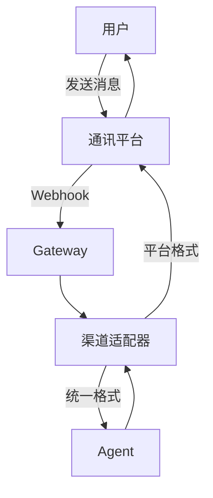

# Channels 参考

Channels 是 OpenClaw 与用户交互的通信管道，支持 20+ 渠道接入，覆盖主流即时通讯平台和自定义接口。

## 支持渠道一览

| 渠道 | 状态 | 富文本 | 文件传输 | 配置难度 |
|------|------|--------|----------|----------|
| WhatsApp | 稳定 | 是 | 是 | 中等 |
| Telegram | 稳定 | 是 | 是 | 简单 |
| Discord | 稳定 | 是 | 是 | 简单 |
| Slack | 稳定 | 是 | 是 | 中等 |
| 微信公众号 | 稳定 | 有限 | 是 | 复杂 |
| 飞书 | 稳定 | 是 | 是 | 中等 |
| 钉钉 | 稳定 | 是 | 是 | 中等 |
| WebChat | 稳定 | 是 | 是 | 简单 |
| REST API | 稳定 | 是 | 是 | 简单 |
| Email | 稳定 | 是 | 是 | 中等 |
| LINE / Messenger | 稳定 | 是 | 是 | 中等 |
| Matrix / Signal | Beta | 是 | 是 | 复杂 |
| Teams / IRC | Beta | 有限 | 否 | 中等 |

## 消息流



## WhatsApp 配置

```yaml
channels:
  whatsapp:
    enabled: true
    provider: cloud-api
    phoneNumberId: "1234567890"
    token: "${WHATSAPP_TOKEN}"
    verifyToken: "${WHATSAPP_VERIFY_TOKEN}"
    webhookPath: /webhook/whatsapp
```

1. 在 Meta 开发者平台创建应用，添加 WhatsApp 产品
2. 获取 Phone Number ID 和永久访问 Token
3. 配置 Webhook 回调地址，订阅 `messages` 事件

## Telegram 配置

```yaml
channels:
  telegram:
    enabled: true
    botToken: "${TELEGRAM_BOT_TOKEN}"
    webhookPath: /webhook/telegram
    parseMode: MarkdownV2
```

1. 在 Telegram 找到 @BotFather，发送 `/newbot` 获取 Token
2. 运行 `openclaw channel setup telegram` 设置 Webhook

## Discord 配置

```yaml
channels:
  discord:
    enabled: true
    botToken: "${DISCORD_BOT_TOKEN}"
    applicationId: "${DISCORD_APP_ID}"
    respondInThread: true
```

1. 在 Discord 开发者门户创建应用，生成 Bot Token
2. 生成邀请链接将 Bot 添加到服务器，开启 Message Content Intent

## Slack 配置

```yaml
channels:
  slack:
    enabled: true
    botToken: "${SLACK_BOT_TOKEN}"
    signingSecret: "${SLACK_SIGNING_SECRET}"
    appToken: "${SLACK_APP_TOKEN}"
    socketMode: true
```

## 微信 / 飞书配置

```yaml
channels:
  wechat:
    enabled: true
    appId: "${WECHAT_APP_ID}"
    appSecret: "${WECHAT_APP_SECRET}"
    token: "${WECHAT_TOKEN}"
  feishu:
    enabled: true
    appId: "${FEISHU_APP_ID}"
    appSecret: "${FEISHU_APP_SECRET}"
    verificationToken: "${FEISHU_VERIFY_TOKEN}"
```

## WebChat 嵌入代码

```html
<script src="https://cdn.openclaw.dev/webchat/v1/widget.js"></script>
<script>
  OpenClawChat.init({
    gatewayUrl: 'https://your-gateway.com',
    apiKey: 'your-public-api-key',
    theme: 'dark',
    position: 'bottom-right',
    title: 'AI 助手',
    welcomeMessage: '你好！有什么可以帮助你的吗？'
  });
</script>
```

## 通用配置选项

| 配置项 | 类型 | 默认值 | 说明 |
|--------|------|--------|------|
| `enabled` | boolean | `false` | 是否启用 |
| `webhookPath` | string | - | Webhook 回调路径 |
| `rateLimit` | number | `60` | 每分钟最大消息数 |
| `maxMessageLength` | number | `4000` | 消息最大字符数 |
| `typingIndicator` | boolean | `true` | 显示输入状态 |
| `allowGroups` | boolean | `false` | 响应群组消息 |
| `mentionOnly` | boolean | `true` | 群组中仅 @提及时响应 |

::: tip
开发测试阶段推荐使用 WebChat 或 Telegram，配置最简单，调试体验最好。
:::
