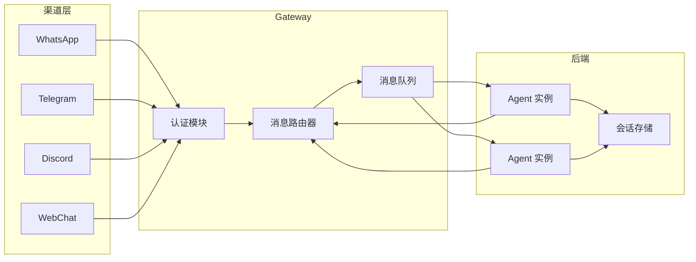

# Gateway 参考

Gateway 是 OpenClaw 的核心守护进程，负责接收来自各渠道的消息、路由到对应 Agent，并将响应返回给用户。

## 架构概览



## 配置文件

Gateway 使用 YAML 配置文件，默认路径为 `~/.openclaw/gateway.yaml`。

```yaml
server:
  host: 0.0.0.0
  port: 3000
  logLevel: info
  cors: { enabled: true, origins: ["*"] }
auth:
  apiKey: "${OPENCLAW_API_KEY}"
  bearerToken: "${OPENCLAW_BEARER_TOKEN}"
providers:
  - name: openai
    apiKey: "${OPENAI_API_KEY}"
    model: gpt-4o
    baseUrl: https://api.openai.com/v1
  - name: anthropic
    apiKey: "${ANTHROPIC_API_KEY}"
    model: claude-sonnet-4-20250514
channels:
  whatsapp: { enabled: true, token: "${WHATSAPP_TOKEN}" }
  telegram: { enabled: true, botToken: "${TELEGRAM_BOT_TOKEN}" }
storage:
  type: sqlite
  path: ~/.openclaw/data/sessions.db
monitoring:
  healthCheck: true
  metricsPort: 9090
```

## 配置选项

| 配置项 | 类型 | 默认值 | 说明 |
|--------|------|--------|------|
| `server.host` | string | `0.0.0.0` | 监听地址 |
| `server.port` | number | `3000` | 监听端口 |
| `server.logLevel` | string | `info` | 日志级别：debug/info/warn/error |
| `server.cors.enabled` | boolean | `true` | 是否启用 CORS |
| `auth.apiKey` | string | - | API 访问密钥（必填） |
| `auth.bearerToken` | string | - | Bearer Token 认证 |
| `providers[].name` | string | - | LLM 提供商名称 |
| `providers[].model` | string | - | 使用的模型标识 |
| `providers[].baseUrl` | string | - | API 端点地址 |
| `storage.type` | string | `sqlite` | 存储类型：sqlite/postgres/redis |
| `storage.path` | string | `~/.openclaw/data/sessions.db` | 数据库路径 |
| `monitoring.healthCheck` | boolean | `true` | 启用健康检查端点 |
| `monitoring.metricsPort` | number | `9090` | Prometheus 指标端口 |

## 启动命令

```bash
openclaw gateway start                              # 默认启动
openclaw gateway start --config /path/to/config.yaml # 指定配置
openclaw gateway start --dev                         # 开发模式
openclaw gateway start --daemon                      # 后台运行
openclaw gateway status                              # 查看状态
openclaw gateway stop                                # 停止服务
```

## 健康检查与监控

```bash
# 基础健康检查
curl http://localhost:3000/health
# {"status":"ok","uptime":3600,"version":"1.2.0"}

# 详细状态
curl http://localhost:3000/health/detailed
# {"status":"ok","channels":{"whatsapp":"connected","telegram":"connected"}}

# Prometheus 指标
curl http://localhost:9090/metrics
```

## 环境变量

| 环境变量 | 对应配置 |
|----------|----------|
| `OPENCLAW_PORT` | `server.port` |
| `OPENCLAW_HOST` | `server.host` |
| `OPENCLAW_LOG_LEVEL` | `server.logLevel` |
| `OPENCLAW_API_KEY` | `auth.apiKey` |
| `OPENCLAW_STORAGE_TYPE` | `storage.type` |

## 故障排查

| 问题 | 可能原因 | 解决方案 |
|------|----------|----------|
| 端口被占用 | 其他进程占用端口 | 修改 `server.port` 或停止占用进程 |
| 渠道连接失败 | Token 配置错误 | 检查对应渠道的 Token 环境变量 |
| LLM 响应超时 | 网络问题或模型过载 | 检查 `providers[].baseUrl`，配置代理 |
| 内存占用过高 | 会话缓存过多 | 调整 `storage` 配置，启用自动清理 |
| 启动闪退 | 配置格式错误 | 运行 `openclaw gateway validate` 检查 |

::: tip
使用 `openclaw gateway validate` 可在启动前验证配置文件的正确性。
:::
