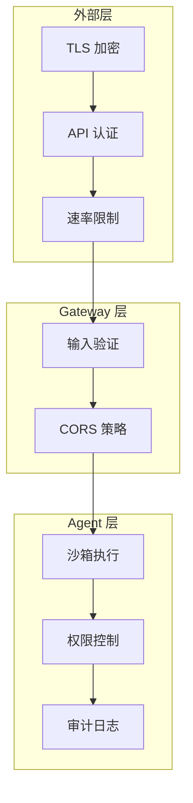

# Security 参考

安全是 OpenClaw 设计的核心关注点。作为可访问本地文件、执行代码、连接外部服务的 AI Agent 系统，OpenClaw 提供多层安全防护。

## 安全架构



## TLS 与认证配置

```yaml
server:
  tls:
    enabled: true
    cert: /etc/openclaw/certs/server.crt
    key: /etc/openclaw/certs/server.key
    minVersion: "1.2"
  cors:
    origins: ["https://your-app.com"]
    methods: ["GET", "POST", "DELETE"]
    credentials: true

auth:
  apiKey:
    keys:
      - name: production
        key: "${OPENCLAW_API_KEY_PROD}"
        permissions: ["chat", "sessions", "skills"]
        rateLimit: 100
      - name: readonly
        key: "${OPENCLAW_API_KEY_READ}"
        permissions: ["chat"]
        rateLimit: 30
  bearer:
    jwtSecret: "${JWT_SECRET}"
    expiresIn: 3600
  ip:
    whitelist: ["10.0.0.0/8", "172.16.0.0/12"]
```

## 沙箱与文件访问权限

```yaml
security:
  sandbox:
    enabled: true
    mode: strict                # strict 或 permissive
    filesystem:
      allowedPaths: [~/Documents/openclaw, ~/Downloads, /tmp/openclaw]
      deniedPaths: [~/.ssh, ~/.gnupg, /etc, /usr]
      maxFileSize: 52428800     # 50MB
      allowedExtensions: ["txt", "md", "json", "csv", "pdf"]
    network:
      allowOutbound: true
      deniedHosts: ["169.254.169.254"]
    execution:
      allowCodeExecution: false
      timeout: 30000
      maxMemory: 256            # MB
```

### 权限级别

| 级别 | 文件读取 | 文件写入 | 代码执行 | 网络 | 系统命令 |
|------|----------|----------|----------|------|----------|
| `minimal` | 仅白名单 | 禁止 | 禁止 | 禁止 | 禁止 |
| `strict` | 仅白名单 | 仅白名单 | 受限 | HTTPS | 禁止 |
| `standard` | 用户目录 | 用户目录 | 受限 | 允许 | 禁止 |
| `permissive` | 大部分 | 用户目录 | 允许 | 允许 | 白名单 |

## API Key 管理

```bash
openclaw security key generate --name production-v2   # 生成新密钥
openclaw security key activate production-v2           # 启用
openclaw security key revoke production-v1             # 停用旧密钥
openclaw security key list                             # 查看所有密钥
```

**最佳实践**：按用途分离密钥，设置过期时间，管理员密钥限制 IP 白名单。

## 审计日志

```yaml
security:
  audit:
    enabled: true
    level: standard           # minimal/standard/verbose
    path: ~/.openclaw/logs/audit.log
    retention: 90             # 保留天数
    events: [auth.success, auth.failure, file.read, file.write, skill.execute]
```

日志示例：

```json
{
  "timestamp": "2026-03-04T10:30:00Z",
  "event": "file.read",
  "actor": "agent:sess_abc123",
  "resource": "/home/user/Documents/report.pdf",
  "result": "allowed"
}
```

## 网络安全建议

| 配置项 | 建议值 |
|--------|--------|
| TLS 最低版本 | TLS 1.2+ |
| HSTS max-age | 31536000 |
| 请求体大小限制 | 10MB |
| 请求超时 | 30 秒 |
| 速率限制 | 按端点配置 |

## 安全检查清单

| 检查项 | 优先级 |
|--------|--------|
| 启用 TLS 加密 | 高 |
| 配置强密码 API Key（32+ 字符） | 高 |
| 限制文件系统访问路径 | 高 |
| 启用速率限制 | 高 |
| 启用代码执行沙箱 | 高 |
| 配置 CORS 白名单（非通配符） | 中 |
| 启用审计日志 | 中 |
| 设置 API Key 过期时间 | 中 |
| 配置 IP 白名单 | 中 |
| 定期轮换 API Key | 低 |

::: danger
生产环境中务必将 `sandbox.mode` 设置为 `strict`。默认的 `permissive` 模式仅适用于开发测试。
:::
